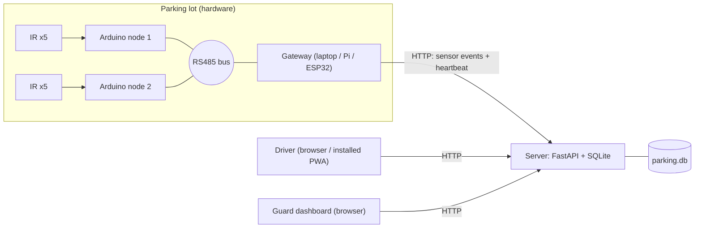
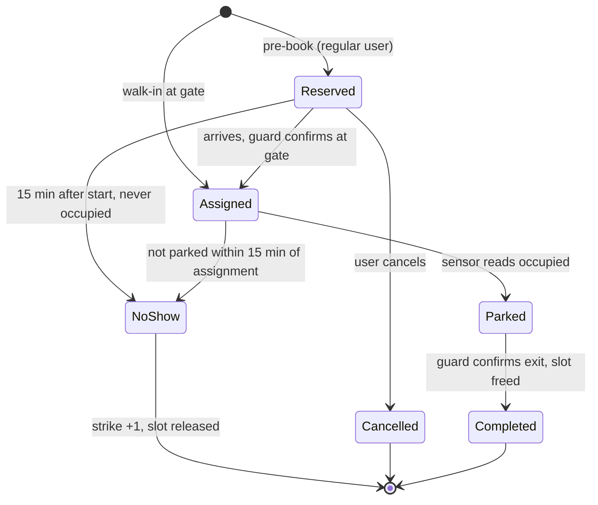

# Smart Parking System: Architecture

Status: v1 draft, agreed decisions from the design discussion on 2026-10-08.

## 1. Decisions locked in

| Topic | Decision |
| --- | --- |
| Scale | Demo with about 10 slots (2 nodes). Design scales to multiple lots (more nodes per bus, one gateway per lot). |
| Slot sensing | One IR sensor per slot, 5 per Arduino node. |
| In-lot link | RS485 half-duplex bus, gateway is master, nodes are slaves. |
| Gateway | Laptop or Raspberry Pi running a Python bridge for the demo. ESP32 is the production story (same protocol). |
| Server | Existing FastAPI + SQLite backend in `Server/`. No cloud hosting for now. |
| Booking model | Walk-ins and reservations. Slot is auto-assigned by the server. Guard confirms at the gate. |
| Users | One web app. Anonymous by default (enter number plate, get directions). Optional install/account for regulars, with pre-booking. |
| Guard | Dashboard plus manual gate control. Gets alerts for sensor/booking mismatches. |
| No-show rule | Reservation expires 15 min after its start time if the slot is never sensed occupied. 3 no-shows in a calendar month means no reservations for the next month (walk-ins still allowed). |

## 2. System context



Four actors, one source of truth:

- **Hardware** only reports *physical* facts (is something in this slot).
- **Server** owns bookings, slot assignment, rules, bans and logs.
- **Driver app** reads state and asks for reservations. It never talks to hardware.
- **Guard dashboard** confirms entry/exit and resolves exceptions.

## 3. Two statuses per slot (already in the schema)

| `digitalstatus` | `physicalstatus` | Meaning | Action |
| --- | --- | --- | --- |
| 0 | 0 | Free | Can be assigned |
| 1 | 0 | Assigned/reserved, car not there yet | Hold until arrival or expiry |
| 1 | 1 | Occupied by the assigned car | Normal |
| 0 | 1 | Car present with no booking | **Alert guard** (unauthorised or sensor fault) |

`digitalstatus` is written only by the server's booking logic. `physicalstatus` is written only by sensor events from the gateway. Keeping the writers separate prevents a flaky sensor from corrupting a booking.

A slot is assignable only when both are 0 (current behaviour).

## 4. Hardware layer

### 4.1 Slot node (Arduino)

- Reads its 5 IR sensors at 10 Hz.
- **Debounce:** a slot changes state only after 30 consecutive identical readings (3 s). This filters passing people and sunlight.
- Holds the 5 bits as a bitmask. Never sends on its own; it only answers when polled (avoids bus collisions).
- Node address is set by DIP switch or EEPROM (1 to 31).

### 4.2 RS485 protocol (gateway is the only master)

Frame (binary, 9600 baud, 8N1):

```
[0x7E] [ADDR] [CMD] [LEN] [PAYLOAD...] [CRC16-L] [CRC16-H]
```

| CMD | Direction | Payload | Meaning |
| --- | --- | --- | --- |
| `0x01` POLL | gateway to node | none | Ask for slot state |
| `0x81` STATE | node to gateway | 1 byte bitmask (bit n = slot n occupied) + 1 byte sensor-fault mask | Reply to POLL |
| `0x02` PING | gateway to node | none | Liveness only |
| `0x82` ACK | node to gateway | none | Reply to PING |

Polling rule: the gateway polls each address in turn about twice a second. A frame is about 8 bytes, so roughly 8 ms on the wire. Even 30 nodes poll in under a second.

Failure handling at the gateway:

- Bad CRC or no reply: retry once, then count a miss.
- 3 misses in a row: node is **offline**. All its slots go `unknown` and the server is told.
- Sensor-fault mask: a sensor stuck for more than 10 minutes with no booking change is flagged.

### 4.3 Gateway to server

The gateway keeps the last known bitmask per node. It posts only **changes**, plus a heartbeat every 10 s.

Gateway authenticates with a shared API key header (`X-Gateway-Key`).

### 4.4 Wiring and parts (per node)

```
IR x5 ──► Arduino Nano ──► MAX485 module ──► A/B twisted pair ──► bus
                                              (120 ohm termination at both ends only)
```

Use one Cat5 cable per bus: one twisted pair for A/B, another pair for 12V/GND (power the nodes centrally, 5V locally via buck or the Nano's regulator).

## 5. Server layer

### 5.1 Components (all in the existing FastAPI app)

| Component | Job |
| --- | --- |
| Booking service | Assign slot, create reservation, check bans, close booking |
| Sensor ingest | Update `physicalstatus`, detect mismatches, mark offline |
| Expiry worker | Background task every 30 s: expire no-shows, release slots, count strikes |
| Alert service | Create and resolve guard alerts |
| Directions | Map slot (floor + name) to a text/graphic route from the gate |

### 5.2 Booking state machine



`NoShow` applies the same 15-minute rule to a walk-in who was assigned a slot at the gate but never parked, but only `kind='reservation'` no-shows count as strikes (section 10).

Ban rule: when a user reaches 3 `NoShow` in a calendar month, set `reserve_banned_until` to the end of the following month. The reserve endpoint rejects with `403`. Gate entry (walk-in) is unaffected.

### 5.3 Key flows

**Walk-in (anonymous user)**

1. Car arrives at the gate. The guard enters the plate in the dashboard (`POST /gate-entry`).
2. Server finds or creates the user by plate, assigns the first free slot, sets `digitalstatus=1`, opens a log.
3. Driver opens the web app, enters the plate, and gets directions (`GET /my-slot?plate=...`).
4. Driver parks. The sensor flips `physicalstatus=1`. Booking becomes `Parked`.
5. On exit the guard enters the plate (`POST /gate-exit`). The log closes and the slot is freed.

**Pre-booked regular**

1. User signs in to the installed web app and requests a slot for a time window.
2. Server checks the ban, picks a free slot and creates a `Reserved` booking (holds `digitalstatus=1` from the start time).
3. At the gate the guard confirms the plate, which moves the booking to `Assigned`. The rest is the same as the walk-in.

**Mismatch alert**

- `0/1` (occupied with no booking): alert "Unbooked car in SLOT-003".
- `1/1` where the plate in the booking differs from the one who entered: out of scope for v1 (no plate camera). The guard handles it by eye.

### 5.4 Identity and access

| Role | Auth | Can do |
| --- | --- | --- |
| Anonymous driver | None | Look up own slot by plate, see lot availability |
| Registered driver | Phone + password (or PIN) | Everything above, plus pre-book, cancel, history |
| Guard | Username + password, session token | Gate entry/exit, dashboard, resolve alerts |
| Gateway | `X-Gateway-Key` | Post sensor events and heartbeat |

Plate-only lookup is low-sensitivity (it only reveals a slot location), but rate-limit it (e.g. 10 requests per minute per IP).

## 6. API surface

Existing endpoints stay as they are: `/health`, `/parking-slots`, `/gate-entry`, `/gate-exit`, `/logs`.

New endpoints:

| Method | Path | Caller | Purpose |
| --- | --- | --- | --- |
| `GET` | `/my-slot?plate=` | Driver | Slot, floor and directions for the active booking |
| `GET` | `/availability` | Driver | Free-slot count per floor |
| `POST` | `/auth/register`, `/auth/login` | Driver | Optional account |
| `POST` | `/reservations` | Driver | Pre-book a slot for a time window (403 if banned) |
| `DELETE` | `/reservations/{id}` | Driver | Cancel |
| `GET` | `/reservations/mine` | Driver | History and strike count |
| `POST` | `/auth/guard-login` | Guard | Session |
| `GET` | `/guard/dashboard` | Guard | Slots (both statuses), active bookings, alerts |
| `POST` | `/guard/alerts/{id}/resolve` | Guard | Close an alert |
| `POST` | `/sensor-events` | Gateway | Array of `{node, slot, occupied, ts}` changes |
| `POST` | `/gateway/heartbeat` | Gateway | Node online/offline list |

## 7. Data model

Existing: `parkingslots`, `users`, `logs`. Additions:

```
parkingslots  + node_id, node_channel, sensor_state ('ok'|'unknown'|'fault'), last_seen
users         + password_hash (nullable), reserve_banned_until (nullable)
bookings      id, userid, slotid, kind ('walkin'|'reservation'),
              status ('reserved'|'assigned'|'parked'|'completed'|'noshow'|'cancelled'),
              start_time, expires_at, created_at
alerts        id, slotid, type ('unbooked_car'|'node_offline'|'sensor_fault'),
              created_at, resolved_at
```

`logs` stays as the visit record (entry and exit times). A booking links to its log through `userid` and `slotid`, or add a `booking_id` column on `logs`.

Strike count is derived: `COUNT(*) FROM bookings WHERE userid=? AND status='noshow' AND start_time` in the current month.

## 8. Bill of materials (demo, 10 slots)

| Item | Qty | Approx. cost (INR) |
| --- | --- | --- |
| Arduino Nano | 2 | 700 |
| IR obstacle sensor (FC-51 or similar) | 10 | 400 |
| MAX485 module | 3 (2 nodes + 1 gateway) | 200 |
| USB to RS485 adapter (or MAX485 + USB-TTL) for the gateway | 1 | 300 |
| 120 ohm resistors, twisted-pair cable, 12V adapter, buck converter | set | 500 |
| Breadboards, jumpers, model slots (cardboard) | set | 300 |
| **Total** | | **about 2,400** |

## 9. Build plan

1. **Server first (software only):** add `bookings`, `alerts`, `/sensor-events`, the expiry worker and `/my-slot`. Test with a fake gateway script that posts events.
2. **Guard dashboard and driver page** against the server.
3. **One node and a gateway on the bench:** 1 Arduino, 5 IRs, MAX485, laptop bridge. Confirm the poll protocol end to end.
4. **Second node on the shared bus.** Test offline, bad-CRC and unplug cases.
5. **Reservations, bans and the installable (PWA) layer.**
6. **Demo script** (see section 11).

Steps 1 to 2 can run in parallel with step 3 because the fake gateway matches the real protocol at the HTTP boundary.

## 10. Resolved decisions (confirmed 2026-10-08)

1. Only **reservation** no-shows count as strikes. A walk-in who never parks has the slot released but no strike.
2. The guard's plate entry at the gate stays **manual** for v1 (OCR later).
3. Registered drivers log in with **phone + password**.
4. A reservation has a **fixed window chosen by the user, max 4 h**, extendable at the gate.

## 11. Demo script

1. Show the free lot on the driver page, then place a toy car in a slot and watch `physicalstatus` flip.
2. Walk-in: guard enters a plate, the slot is assigned, the driver page shows directions.
3. Park, then exit via the guard.
4. Reservation: pre-book, wait through the 15 min expiry (shorten to 30 s for the demo), show the strike counter.
5. Unplug a node: the guard sees the offline alert and its slots go `unknown`.
6. Put a car in an unbooked slot: the guard sees the unbooked-car alert.
